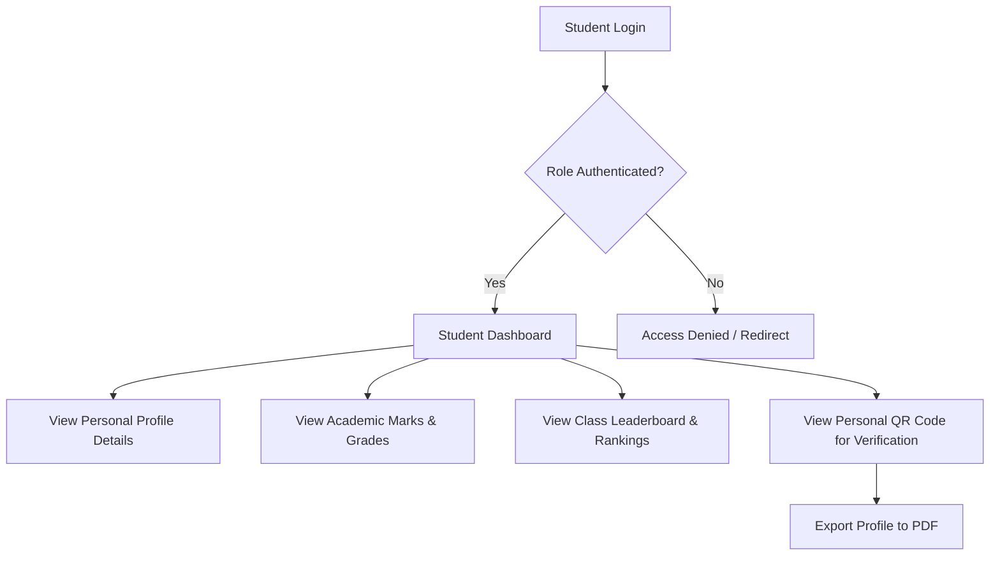
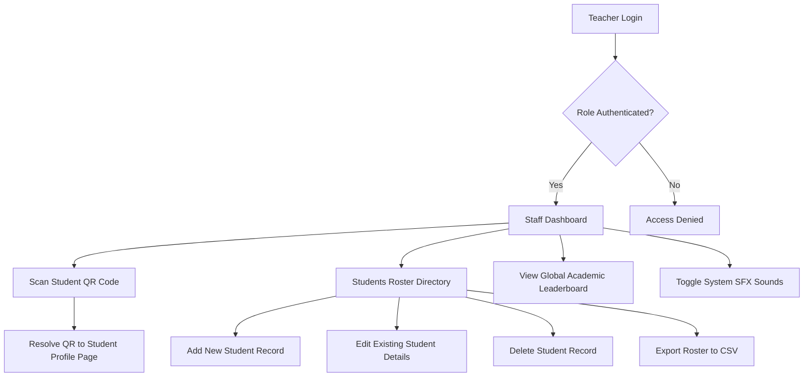
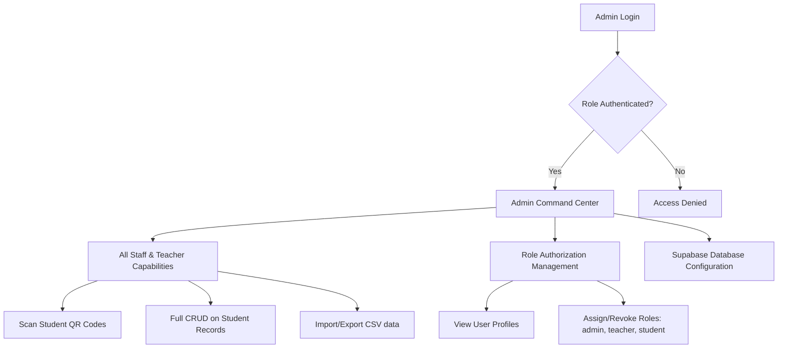
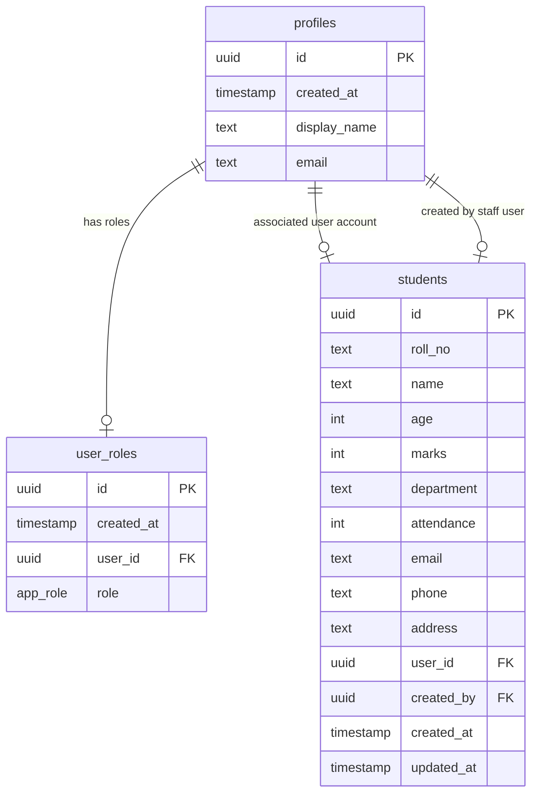

# Implementation Plan - Correcting Codebase Errors & Architectural Diagrams

This plan outlines the fixes for the remaining ESLint and TypeScript warnings/errors in the codebase. Additionally, it details the system workflow and database architecture with four interactive diagrams.

---

## User Review Required

No major breaking changes are introduced. All edits are to improve type safety and resolve static analysis (ESLint) errors in the front-end components.

---

## Open Questions

None. The schema and workflows have been fully mapped from the existing repository code.

---

## Proposed Changes

### Resolve ESLint/TypeScript Warnings & Errors

We will remove all instances of `any` casts (which trigger the `@typescript-eslint/no-explicit-any` rule) and empty statements (`no-empty`).

#### [MODIFY] [sound.ts](file:///c:/Users/ASUS/Downloads/AGR%20docs/Student-Information-System-main/src/lib/sound.ts)

- Replace `(window as any).webkitAudioContext` with `(window as unknown as { webkitAudioContext?: typeof AudioContext }).webkitAudioContext` to avoid using `any`.

#### [MODIFY] [dashboard.tsx](file:///c:/Users/ASUS/Downloads/AGR%20docs/Student-Information-System-main/src/routes/dashboard.tsx)

- Replace the `any` cast in `.then(({ data }) => setStudents((data as any) ?? []))` with `(data as unknown as Student[]) ?? []`.
- Type the `icon` prop in `StatCard` from `any` to `React.ComponentType<{ className?: string }>`.

#### [MODIFY] [leaderboard.tsx](file:///c:/Users/ASUS/Downloads/AGR%20docs/Student-Information-System-main/src/routes/leaderboard.tsx)

- Replace the `any` cast in `.then(({ data }) => setItems((data as any) ?? []))` with `(data as unknown as Student[]) ?? []`.

#### [MODIFY] [login.tsx](file:///c:/Users/ASUS/Downloads/AGR%20docs/Student-Information-System-main/src/routes/login.tsx)

- Type `icon` in the `ROLES` array config to `React.ComponentType<{ className?: string }>`.
- Avoid `any` in `catch (err: any)` by typing it as `catch (err)` and using type assertion `const error = err as Error`.

#### [MODIFY] [scan.tsx](file:///c:/Users/ASUS/Downloads/AGR%20docs/Student-Information-System-main/src/routes/scan.tsx)

- Add a debug log to the empty `catch {}` statement so it complies with the `no-empty` ESLint rule.
- Type `e: any` in the catch block to `e: unknown` and cast appropriately.

#### [MODIFY] [settings.tsx](file:///c:/Users/ASUS/Downloads/AGR%20docs/Student-Information-System-main/src/routes/settings.tsx)

- Type the `icon` prop in `Row` to `React.ComponentType<{ className?: string }>` instead of `any`.

#### [MODIFY] [student.$id.tsx](file:///c:/Users/ASUS/Downloads/AGR%20docs/Student-Information-System-main/src/routes/student.%24id.tsx)

- Define a local `Student` type (or import it) and change state definition `useState<any>(null)` to `useState<Student | null>(null)`.
- Type `icon` and other arguments in the `Info` component to resolve the `any` warning.

#### [MODIFY] [students.tsx](file:///c:/Users/ASUS/Downloads/AGR%20docs/Student-Information-System-main/src/routes/students.tsx)

- Replace all `any` casts (e.g., `data as any`, `rest as any`, `form as any`, `err: any`) with proper TypeScript type assertions or type annotations.

---

## Architectural Diagrams

Here are the four requested workflow and database diagrams.

### 1. Student Workflow Diagram

This workflow describes how a Student interacts with the system after logging in.

### 2. Teacher Workflow Diagram

This workflow outlines a Teacher's capabilities, focusing on scanning and record management.

### 3. Admin Workflow Diagram

This workflow represents the ultimate administrative command center access.

### 4. Database Schema Diagram (Entity-Relationship)

The relational mapping between tables managed inside Supabase.

