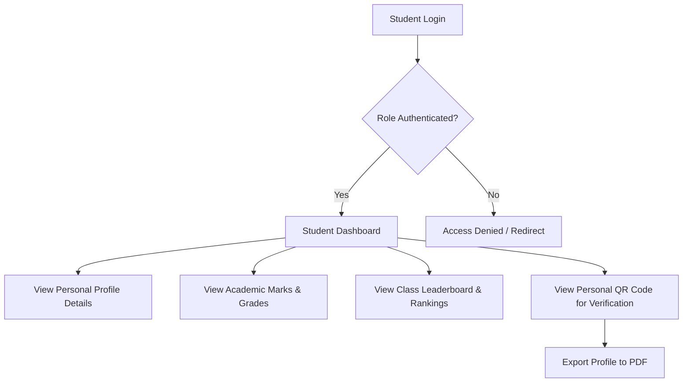
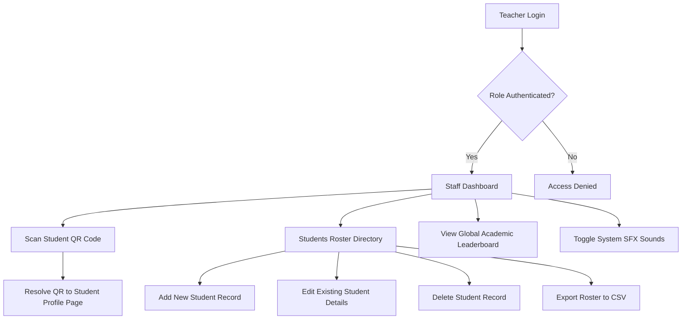
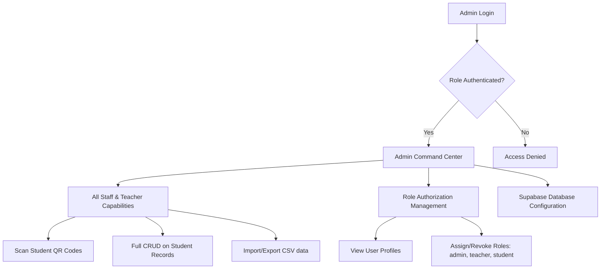

# Student Information System (SIS) - Complete Documentation

Welcome to the **Student Information System (SIS)**, a modern, futuristic command center web application designed for educational institutions to manage and view student records, grades, rankings, and directories. Built with high-fidelity aesthetics, neon glow visual styles, responsive layouts, and interactive micro-animations.

---

## 🚀 Key Features

### 👨‍🎓 1. Student Portal

- **Dashboard & Performance Overview**: View GPA, grade categories, and grade calculations dynamically.
- **Verification QR Code**: Generate custom, download-ready QR codes linking to student profile pages.
- **Profile Export**: Download individual student details in a styled, formatted PDF sheet.
- **Academic Rankings**: View the class leaderboard containing peer ranks.

### 👩‍🏫 2. Teacher Portal

- **Camera-Based QR Scanner**: Use the device camera to scan students' QR codes and instantly view their full profiles.
- **Full student CRUD**: Create, edit, and delete student records directly from a tabular directory.
- **Roster Exporting**: Download complete student rosters as CSV files.
- **Global Leaderboard**: Track highest, average, and lowest class scores.

### 👑 3. Admin Command Center

- **System Administration**: Full administrative override permissions on all directories.
- **Role Assignment**: Manage roles (`student`, `teacher`, `admin`) for auth users to secure endpoints.
- **Supabase Integration**: Seamless syncing and real-time validation via Supabase backend.

---

## 🛠️ Technology Stack

- **Frontend Core**: React 19, TypeScript 5, Vite 7
- **Routing & Fetching**: TanStack Start (Vite-TanStack routing engine), TanStack Router & Query
- **Styling**: Tailwind CSS (utilizing curated dark mode neon design tokens)
- **Database & Auth**: Supabase (PostgreSQL database, Row-Level Security, Auth)
- **Data & Exporting**: Recharts (for charts), `jspdf` (for PDF exports), `html5-qrcode` (for scanning), `qrcode` (for QR generation)
- **Audio Experience**: Pure WebAudio API synthesizer (for interactive click/success/error sounds)

---

## 📂 Project Architecture

```
Student-Information-System-main/
├── .env                  # Configuration keys for Supabase API connections
├── package.json          # Node scripts and dependency declarations
├── vite.config.ts        # Vite configuration & TanStack Start routing setup
├── tsconfig.json         # TypeScript configurations
├── supabase/             # Supabase configurations and migration assets
└── src/                  # Main Application Folder
    ├── start.ts          # Entry point for Server/Client bootstrapping
    ├── server.ts         # Server configuration
    ├── router.tsx        # TanStack Router initialization
    ├── styles.css        # Core stylesheet containing glow animations and layout themes
    ├── components/       # Reusable components (AppShell, StudentQR, and UI templates)
    ├── hooks/            # Custom hooks for auth-middleware, roles checking (useRoles)
    ├── integrations/     # Supabase connection client setup and auto-generated types
    ├── lib/              # Helper utilities (sound, csv/pdf exporters, grade calculators)
    └── routes/           # File-based routes directory
        ├── __root.tsx    # App template (Header, Sidebar container)
        ├── index.tsx     # Landing page
        ├── login.tsx     # Authentication page (Student, Teacher, and Admin options)
        ├── dashboard.tsx # Charts, performance counters, and analytics view
        ├── students.tsx  # Interactive directory tables and student CRUD
        ├── student.$id.tsx # Single detailed student view (exports, QR code display)
        ├── leaderboard.tsx # Global ranking list
        ├── scan.tsx      # QR Code scanning portal
        └── settings.tsx  # Audio configuration toggle
```

---

## 📊 Database Schema (Supabase)

The system consists of three main tables:

### 1. `profiles`

Stores general metadata of users who sign up through Supabase Auth.

- `id` (uuid, Primary Key): Links to auth user ID.
- `created_at` (timestamp)
- `display_name` (text, nullable)
- `email` (text, nullable)

### 2. `user_roles`

Tracks assigned application permissions.

- `id` (uuid, Primary Key)
- `created_at` (timestamp)
- `user_id` (uuid, Foreign Key referencing `profiles.id`)
- `role` (enum `app_role` - `'admin' | 'teacher' | 'student'`)

### 3. `students`

Holds all academic records.

- `id` (uuid, Primary Key)
- `roll_no` (text): Student's identifier number.
- `name` (text)
- `age` (integer)
- `marks` (integer): Range 0-100.
- `department` (text)
- `attendance` (integer): Range 0-100.
- `email` (text, nullable)
- `phone` (text, nullable)
- `address` (text, nullable)
- `user_id` (uuid, Foreign Key referencing `profiles.id` - link to student account)
- `created_by` (uuid, Foreign Key referencing `profiles.id` - staff audit)
- `created_at` / `updated_at` (timestamps)

---

## 🔄 System Workflows

### Student Workflow



### Teacher Workflow



### Admin Workflow



---

## 🛠️ Local Development & Setup

Follow these steps to run the application locally on your machine.

### Prerequisites

- Node.js (v18 or higher recommended)
- NPM

### 1. Setup Environment Variables

Create a `.env` file in the root directory:

```env
SUPABASE_PROJECT_ID="your-supabase-project-id"
SUPABASE_PUBLISHABLE_KEY="your-anon-publishable-key"
SUPABASE_URL="https://your-project-id.supabase.co"
VITE_SUPABASE_PROJECT_ID="your-supabase-project-id"
VITE_SUPABASE_PUBLISHABLE_KEY="your-anon-publishable-key"
VITE_SUPABASE_URL="https://your-project-id.supabase.co"
```

### 2. Install Dependencies

```bash
npm install
```

### 3. Run Development Server

```bash
npm run dev
```

Open [http://localhost:8080/](http://localhost:8080/) in your browser to view the application.

### 4. Code Quality & Formatting

Run prettier to auto-format files:

```bash
npm run format
```

Run ESLint to check for code standard violations:

```bash
npm run lint
```

### 5. Build for Production

Create the compiled bundle ready for deployment:

```bash
npm run build
```

The output will be created inside the `.output` directory.
